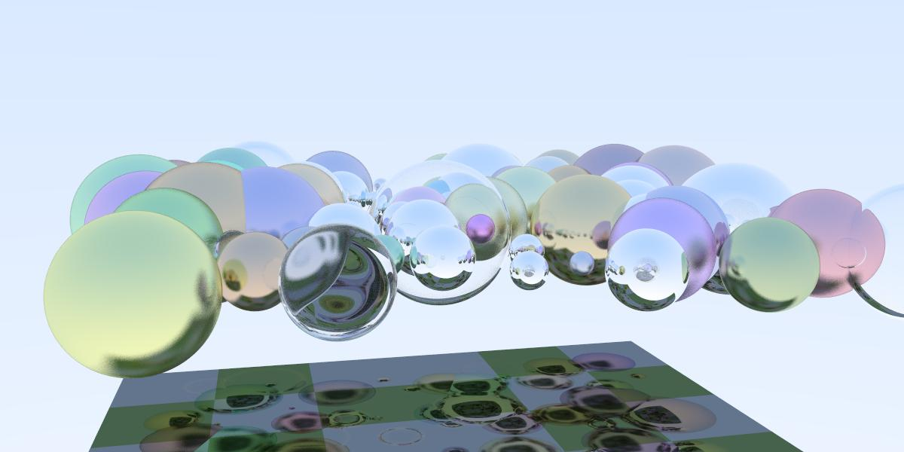
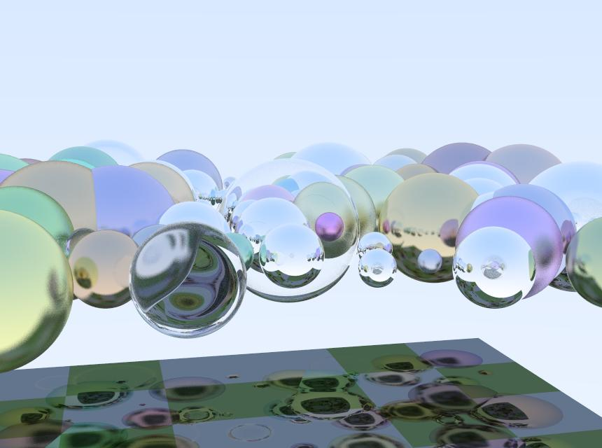

# Ray-tracing by CUDA

## Overview

Create ray tracing with CUDA. Scene is generated by cuRand. Implemented:

* common geometry: sphere and plane

* materials: dielectric, metal, lambertian

* physical properties: schlick, refract, reflect

## How to use

* To generate ppm file:

* Convert ppm file to jpg:

## System configuration

| Name  | Values  |
|-------|---------|
| CPU  | Intel® Core™ i7-8750H CPU @ 2.20GHz (Turbo Boost  4.10 GHz) × 12 |
| RAM  | 16 GB DDR4 |
| GPU  | GeForce GTX 1060 with Max-Q Design/PCIe/SSE2 |
| OS type | 64-bit  |

## Results

Recursion depth: 10

Plate counts: 1

Sphere counts: 100

* Image size 1200x600:

    

    Its took 95.5656 seconds.

* Image size 860*640:

    

    Its took 78.9646 seconds.
